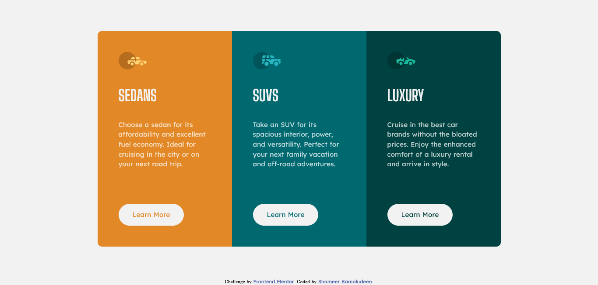

# Frontend Mentor - 3-column preview card component solution

This is a solution to the [3-column preview card component challenge on Frontend Mentor](https://www.frontendmentor.io/challenges/3column-preview-card-component-pH92eAR2-). Frontend Mentor challenges help you improve your coding skills by building realistic projects. 

## Table of contents

- [Overview](#overview)
  - [The challenge](#the-challenge)
  - [Screenshot](#screenshot)
  - [Links](#links)
- [My process](#my-process)
  - [Built with](#built-with)
  - [What I learned](#what-i-learned)
  - [Useful resources](#useful-resources)
- [Author](#author)
- [Acknowledgments](#acknowledgments)

## Overview

The solution is made using a responsive layout. 

The challenge faced during the design of this component is on responsiveness, even though comparatively easy design it seems like but the responsiveness was really challenging because aligning elements vertically as well as horizontally on the responsive caused problem and learned a very good point of adding dummy element or elements to make elements even in each row to solve the alignment problem. 

This solution may help in the future a lot.

### The challenge

Users should be able to:

- View the optimal layout depending on their device's screen size
- See hover states for interactive elements

### Screenshot

### Links

- Solution URL: [Click here](https://github.com/shameerkamaludeen/3-column-preview-card-component)
- Live Site URL: [Click here](https://shameerkamaludeen.github.io/3-column-preview-card-component/)

## My process

### Built with

- Semantic HTML5 markup
- Flexbox
- Mobile-first workflow

### What I learned

A useful thing has learned from the challenge was adding dummy element or elements to make even rows to align items or elements vertically as well as horizontally whether using flexbox or floating element. 

### Useful resources

- [Flex-box: Align last row to grid](https://stackoverflow.com/questions/18744164/flex-box-align-last-row-to-grid) - This helped me align the last card in the vehicle list to align along with its above card in the second row.

## Author

- Github - [Shameer Kamaludeen](https://github.com/shameerkamaludeen)
- Frontend Mentor - [@shameerkamaludeen](https://www.frontendmentor.io/profile/shameerkamaludeen)
- Twitter - [@ShameerKamalud1](https://twitter.com/ShameerKamalud1)

## Acknowledgments

As usual, this time also with the help of the Frontend Mentor learned a new technique which I mentioned above, it is so important in designing element layout, and really thankful for them for this opportunity to learn.
